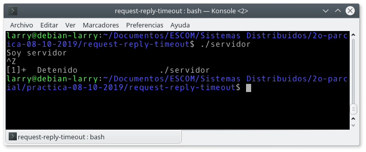

# request-reply-timeout
Implementa el protocolo de petición-respuesta sobre UDP utilizando timeout.

Para compilar:

```make```

Para ejecutar el servidor:

```./servidor```

Para ejecutar el cliente (**Ejercicio 1**):

```./cliente <número a> <número b>```

En el caso del cliente especificar el puerto `7200`, que es el puerto fijo del servidor y posteriormente la dirección ip (la debe obtener directamente del servidor).

En el **Ejercicio 1** el cliente envía la misma solicitud de la práctica anterior (solicita la suma de dos números al servidor). En este caso para probar que funciona el **timeout** de 2.5 segundos, antes de ingresar los parámetros para conectarse al servidor (puerto e IP) debe detenerse al servidor con `ctrl + Z`.




