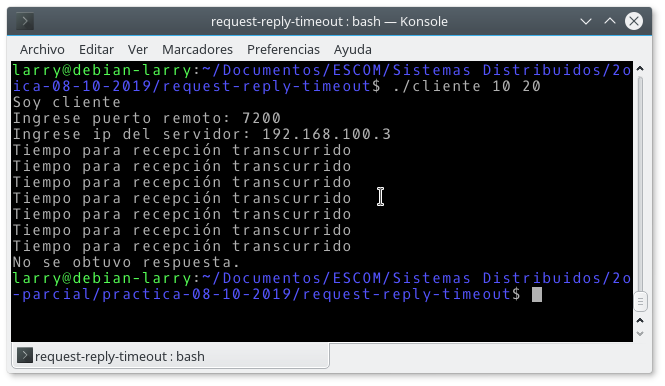

# request-reply-timeout
Implementa el protocolo de petición-respuesta sobre UDP utilizando timeout.

Para compilar:

```make```

Para ejecutar el servidor:

```./servidor```

Para ejecutar el cliente (**Ejercicio 1**):

```./cliente <número a> <número b>```

### Ejercicio 1

En el caso del cliente especificar el puerto `7200`, que es el puerto fijo del servidor y posteriormente la dirección ip (la debe obtener directamente del servidor).

En el **Ejercicio 1** el cliente envía la misma solicitud de la práctica anterior (solicita la suma de dos números al servidor). En este caso para probar que funciona el **timeout** de 2.5 segundos, antes de ingresar los parámetros para conectarse al servidor (puerto e IP) debe detenerse al servidor con `ctrl + Z`.




### Ejercicio 2

En este caso se pasarán como parámetros en la línea de comandos el puerto, la IP y el número de solicitudes que queremos enviar en un ciclo al servidor ya que queremos medir el tiempo con el comando `time`.

Para ejecutar el programa (**Ejercicio 2**):

1. Cambiar a la rama correspondiente:

```git checkout ej2```

2. Compilar de nuevo: `make`

3. Ejecutar el servidor: `./servidor`

4. Ejecutar el cliente:

```time ./cliente <puerto> <IP> <número de solicitudes>```


#### Maximizar el número de operaciones:

Probar con TAM_MAX_DATA a 128 (4000 originalmente).

Se sugiere comentar las líneas `cout` en las funciones `getRequest` y `sendReply` en `Respuesta.cpp` y en la función `main` de `cliente.cpp` para medir los tiempos de respuesta si no hay impresiones de pantalla.